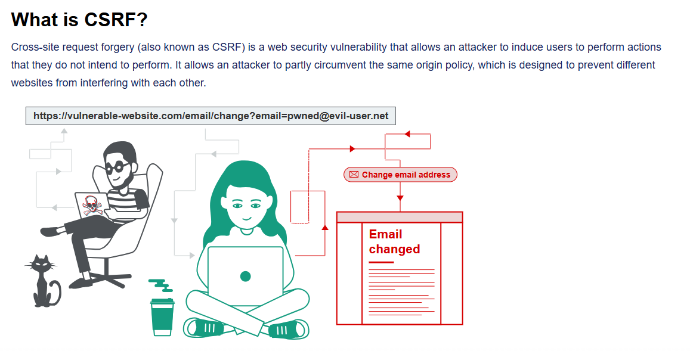

# CSRF

Created: April 23, 2025 11:39 PM

## **How does CSRF work?**

For a CSRF attack to be possible, three key conditions must be in place:

- **A relevant action.** There is an action within the application that the attacker has a reason to induce. This might be a privileged action (such as modifying permissions for other users) or any action on user-specific data (such as changing the user's own password).
- **Cookie-based session handling.** Performing the action involves issuing one or more HTTP requests, and the application relies solely on session cookies to identify the user who has made the requests. There is no other mechanism in place for tracking sessions or validating user requests.
- **No unpredictable request parameters.** The requests that perform the action do not contain any parameters whose values the attacker cannot determine or guess. For example, when causing a user to change their password, the function is not vulnerable if an attacker needs to know the value of the existing password.

## **Common defences against CSRF**

Nowadays, successfully finding and exploiting CSRF vulnerabilities often involves bypassing anti-CSRF measures deployed by the target website, the victim's browser, or both. The most common defenses you'll encounter are as follows:

- **CSRF tokens** - A CSRF token is a unique, secret, and unpredictable value that is generated by the server-side application and shared with the client. When attempting to perform a sensitive action, such as submitting a form, the client must include the correct CSRF token in the request. This makes it very difficult for an attacker to construct a valid request on behalf of the victim.
- **SameSite cookies** - SameSite is a browser security mechanism that determines when a website's cookies are included in requests originating from other websites. As requests to perform sensitive actions typically require an authenticated session cookie, the appropriate SameSite restrictions may prevent an attacker from triggering these actions cross-site. Since 2021, Chrome enforces `Lax` SameSite restrictions by default. As this is the proposed standard, we expect other major browsers to adopt this behavior in future.
- **Referer-based validation** - Some applications make use of the HTTP Referer header to attempt to defend against CSRF attacks, normally by verifying that the request originated from the application's own domain. This is generally less effective than CSRF token validation.

CSRF Protection common flaws:

1. CSRF token validation depends on HTTP method (vulnerable to HTTP Verb Tampering)
2. CSRF validation happens only when the CSRF token is non null
3. CSRF token is not tied to the session cookie, validation is performed on a global token pool
4. CSRF token is not tied to the session cookie, and instead uses another special cookie to verify validity (if the application has a vulnerability that allows Set-Cookie injection, then CSRF protection could be bypassed by pasting a valid pair of CSRF param + CSRF cookie from another session)
5. CSRF token is simply duplicated in cookie (the same as with previous, can be bypassed if the website contains Set-Cookie injection)

Auto-craft CSRF payloads:

Cookie-setting functionality:
`/?search=test%0d%0aSet-Cookie:%20csrfKey=YOUR-KEY%3b%20SameSite=None`

Triggering Cookie-setting+CSRF

``

SameSite:

**Strict**: cookies is not delivered in any cross-site requests

[Strict Same-Site bypass via client side redirect](CSRF/Strict%20Same-Site%20bypass%20via%20client%20side%20redirect%201df021737a8980948a35f6471d364c15.md)

[Strict Same-Site bypass via sibling domain XSS](CSRF/Strict%20Same-Site%20bypass%20via%20sibling%20domain%20XSS%201e0021737a898035a117c4bee93fcafb.md)

**Lax**:

To understand whether the request is “Top-level navigation”, look at the URL displayed:
1. URL stays the same after the request → Not top-level navigation (like loading [site-b.com](http://site-b.com) in the `iframe` of site-a.com)

2. URL is different after the request → Top-level navigation (like going to [site-b.com](http://site-b.com) using a `href` on [site-a.com](http://site-a.com) ) 

[Bypass Same-site Lax using method switch](CSRF/Bypass%20Same-site%20Lax%20using%20method%20switch%201e0021737a8980b1ae4dcd076e0ff117.md)

[Bypass Same-site Lax using force session refresh](CSRF/Bypass%20Same-site%20Lax%20using%20force%20session%20refresh%201e0021737a8980788e18d1e7d5c0c9f2.md)

**None**:

---

[CSRF Referrer-based protection bypass (skip when not present)](CSRF/CSRF%20Referrer-based%20protection%20bypass%20(skip%20when%20n%201e0021737a8980ea9231efd797ffbeeb.md)

[CSRF Referrer-based protection bypass (broken validation)](CSRF/CSRF%20Referrer-based%20protection%20bypass%20(broken%20vali%201e0021737a8980478cb5fbb49722a33d.md)