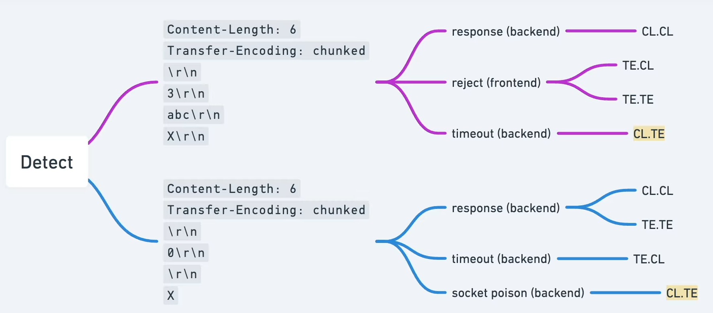

# Detecting CL.TE methodology

We will take 1st payload for the detection purposes



### Understanding the probing payload


```xml
POST / HTTP/1.1
Host: 0a03000604f73bd78145459f00ec005e.web-security-academy.net
Content-Type: application/x-www-form-urlencoded
Content-Length: 6
Transfer-Encoding: chunked

3
abc
X
```

1 - HTTP protocol is downgraded to version 1.1 because HTTP 2 is immune to smuggling attacks (except the case when the protocol downgrade is performed)

2 - Both Content-Length and Transfer-Encoding headers are used here, to confuse different systems (more about [Transfer-Encoding](https://ru.hexlet.io/courses/http_protocol/lessons/chunked/theory_unit)). Chunks are built on the following pattern:

```xml
<chunk content length in HEX, e.g. 3> <**\r\n** aka CRLF> <chunk content> <\r\n aka CRLF>
```

3 - `\r\n` is a special sequence also known as **CRLF**, that means new line in HTTP protocol. Body must be always separated from the headers by `\r\n` , which is done on line 6


4 - Number `3` in line 7 says “we are sending a chunk of 3 bytes”

5 - Contents of the chunk itself (abc)

6 - `X` is an invalid character, that cannot be interpreted as a HEX byte length, so it immediately causes the backend (the system that uses TE method) to throw an error out of confusion and make it halted, waiting for something except that garbage. This will confirm CL.TE nature of the vulnerability


[DeepSeek convo to understand the concept](Detecting%20CL%20TE%20methodology/DeepSeek%20convo%20to%20understand%20the%20concept%20264021737a89801891d1f7ada23bde39.md)

[Lab: HTTP request smuggling, basic CL.TE vulnerability](https://www.youtube.com/watch?v=4S5fkKJ4SM4)