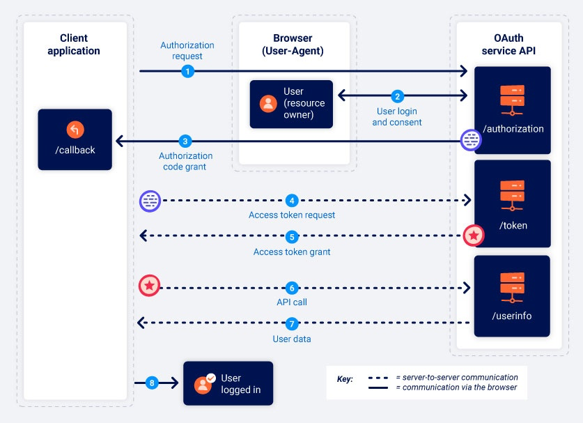

# OAuth

Created: October 20, 2025 10:44 AM

## Grant types

### Authentication code grant type

### Implicit grant type

## Writeups

[**Authentication bypass via OAuth implicit flow**](OAuth/Authentication%20bypass%20via%20OAuth%20implicit%20flow%20292021737a898023b824fe041de76d31.md)

[**Forced OAuth profile linking**](OAuth/Forced%20OAuth%20profile%20linking%20292021737a898097a573cdad312e6553.md)

[**OAuth account hijacking via redirect_uri**](OAuth/OAuth%20account%20hijacking%20via%20redirect_uri%20292021737a898011a98dce73a5de8e8f.md)

[Stealing OAuth Access token via Open Redirect](OAuth/Stealing%20OAuth%20Access%20token%20via%20Open%20Redirect%20292021737a898027b139f98d2dd8eeae.md)

[**SSRF via OpenID dynamic client registration**](OAuth/SSRF%20via%20OpenID%20dynamic%20client%20registration%20294021737a8980b38bf9f7af080024bd.md)

[EXPERT: **Stealing OAuth access tokens via a proxy page**](OAuth/EXPERT%20Stealing%20OAuth%20access%20tokens%20via%20a%20proxy%20pa%202be021737a8980d8b122e4a38e3c566c.md)