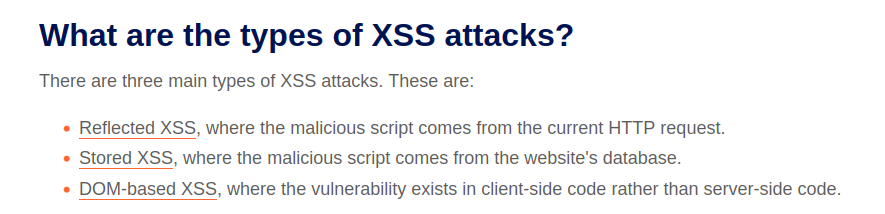

# XSS

Created: November 4, 2025 8:59 PM

[**DOM XSS in AngularJS expression with angle brackets and double quotes HTML-encoded**](XSS/DOM%20XSS%20in%20AngularJS%20expression%20with%20angle%20bracket%202a7021737a8980d996dddb8bfdc3b3c7.md)

[**DOM XSS in `document.write` sink using source `location.search` inside a select element**](XSS/DOM%20XSS%20in%20document%20write%20sink%20using%20source%20locati%202a7021737a8980d5a1f8c309e549bcbf.md)

[**Reflected DOM XSS**](XSS/Reflected%20DOM%20XSS%202a7021737a8980b1a7c2ffa618593c1b.md)

[**Stored DOM XSS**](XSS/Stored%20DOM%20XSS%202a7021737a8980ecae56f53fc9c8404a.md)

[**Reflected XSS into HTML context with most tags and attributes blocked**](XSS/Reflected%20XSS%20into%20HTML%20context%20with%20most%20tags%20and%202a7021737a89802e9a6be0764966e12c.md)

[**Reflected XSS into HTML context with all tags blocked except custom ones**](XSS/Reflected%20XSS%20into%20HTML%20context%20with%20all%20tags%20bloc%202ab021737a898048a533db1e8b65f7e1.md)

[**Reflected XSS with some SVG markup allowed**](XSS/Reflected%20XSS%20with%20some%20SVG%20markup%20allowed%202ab021737a8980878769df7619ebbbf4.md)

[**Reflected XSS in canonical link tag**](XSS/Reflected%20XSS%20in%20canonical%20link%20tag%202ab021737a898069a55fc2d3d2b4375d.md)

[**Reflected XSS into a JavaScript string with single quote and backslash escaped**](XSS/Reflected%20XSS%20into%20a%20JavaScript%20string%20with%20single%202ae021737a8980f9891ae1e89c25d858.md)

[**Reflected XSS into a JavaScript string with angle brackets and double quotes HTML-encoded and single quotes escaped**](XSS/Reflected%20XSS%20into%20a%20JavaScript%20string%20with%20angle%20%202ae021737a89802a9820ea809589a9db.md)

[**Stored XSS into `onclick` event with angle brackets and double quotes HTML-encoded and single quotes and backslash escaped**](XSS/Stored%20XSS%20into%20onclick%20event%20with%20angle%20brackets%20%202af021737a898026b6d6ce8fc881d98c.md)

[**Reflected XSS into a template literal with angle brackets, single, double quotes, backslash and backticks Unicode-escaped**](XSS/Reflected%20XSS%20into%20a%20template%20literal%20with%20angle%20b%202af021737a8980fb846aeef15441f2e0.md)

[**Exploiting cross-site scripting to steal cookies**](XSS/Exploiting%20cross-site%20scripting%20to%20steal%20cookies%202af021737a89808bb123e9a7e68159c5.md)

[**Exploiting cross-site scripting to capture passwords**](XSS/Exploiting%20cross-site%20scripting%20to%20capture%20passwor%202af021737a8980d88371f6d315d50725.md)

[**Exploiting XSS to bypass CSRF defenses**](XSS/Exploiting%20XSS%20to%20bypass%20CSRF%20defenses%202af021737a898037af4ef378d87ee70a.md)

[**Reflected XSS protected by very strict CSP, with dangling markup attack**](XSS/Reflected%20XSS%20protected%20by%20very%20strict%20CSP,%20with%20d%202af021737a8980ab88ffcbaad9006f42.md)

[EXPERT: **Reflected XSS with AngularJS sandbox escape without strings**](XSS/EXPERT%20Reflected%20XSS%20with%20AngularJS%20sandbox%20escape%202bc021737a8980c78f9dfa892683e1ff.md)

[EXPERT: **Reflected XSS with AngularJS sandbox escape and CSP**](XSS/EXPERT%20Reflected%20XSS%20with%20AngularJS%20sandbox%20escape%202bc021737a8980bfafd0ea2faaf7de6c.md)

[EXPERT: **Reflected XSS with event handlers and `href` attributes blocked**](XSS/EXPERT%20Reflected%20XSS%20with%20event%20handlers%20and%20href%20%202bc021737a8980e6ad08f570e93f5ccd.md)

[EXPERT: **Reflected XSS in a JavaScript URL with some characters blocked**](XSS/EXPERT%20Reflected%20XSS%20in%20a%20JavaScript%20URL%20with%20some%202bc021737a89808cb909edcc4d484503.md)

[EXPERT: **Reflected XSS protected by CSP, with CSP bypass**](XSS/EXPERT%20Reflected%20XSS%20protected%20by%20CSP,%20with%20CSP%20by%202bc021737a8980c7a57ced65381ac231.md)