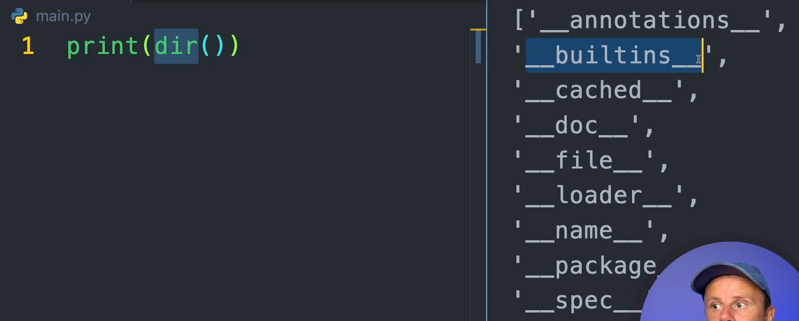

# Basics

Created: May 26, 2025 4:48 PM

Python — интерпретируемый объектно-ориентированный язык.

У классов есть атрибуты. Если атрибут имеет значение-функцию, то это — метод.

### Типы данных

1. str
2. int
3. float
4. bool (важно — потомок int)
5. list
6. tuple
7. dict
8. set
9. complex

Строки в Python немутирующие (**Immutable**).

### Некоторые важные встроенные функции

1. print()
2. type()
3. id()
4. len()
5. sum()
6. input()
7. round()
8. min()
9. max()
10. int()
11. str()
12. bool()
13. dir() — получить встроенные атрибуты объекта
14. id() — адрес объекта в памяти

### Отступы (Intendation)

Тела функции отделяются 4 пробелами (или одним TAB)

### PEP8

### Многострочные литералы

Добавив три двойных кавычки, можно переносить строку

### Конвертация типов

В примере ниже нет ошибки, но и нет неявной конвертации. Вместо этого, оператор сложения заменяется магическим методом.

### Магические методы

Магический метод — функция, начинающаяся и заканчивающаяся на `__` , не предназначенная для явного использования. Вместо этого, она вызывается скрыто, “магическим” образом. Пример:

Интерпретатор представляет операнд `*` как магический метод `__mul__` , вызванный на первом операнде. После этого получается ошибка NotImplemented. Интерпретатор в ответ пробует вызвать правосторонний магический метод у другого операнда — `__rmul__` . И уже этот метод корректно отрабатывает и возвращает результат

### List

Удаление элементов списка — оператор del

Некоторые методы list

Сложение списков Python — магические методы

Нарезка списков — [0:1], [0:-1] (отрицательные читай “индекс 1 с конца”)

### Словари (dict)

Метод `get`  — перестраховка от KeyError. Если элемента нет, вернется None

### Кортежи (tuple)

### Наборы (Set)

### Диапазоны (range)

### Сравнение типов последовательностей

### Функция zip

