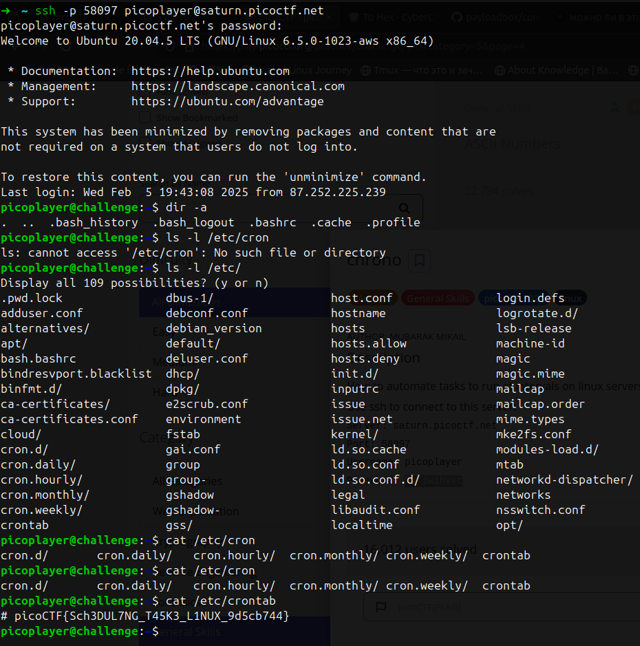

# chrono

Created: February 5, 2025 10:51 PM

Задача гласит, что решение связано с запланированными задачами на Linux. Как известно, для этого есть инструмент cron. Флаг можно найти, всего лишь прочитав crontab

