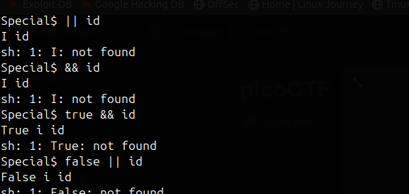

# special

Created: February 5, 2025 10:02 PM

Фишка задания — на баше стоит спеллчекер, который автоматически делает первую букву инпута заглавной, а также фильтрует некоторые символы и попытки обращения пути (если она вначале инпута)

Решение — пускай у нас будет переменная с заглавной буквы. В нее мы передадим команду, а потом в том же запросе через ; выполним ее нативным баш синтаксисом:

Можем выполнять команды, флаг получен!