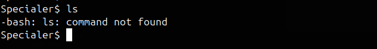

# specialer

Created: February 5, 2025 9:14 PM

Фишка задачи в том, что из /bin удалены все бинарники, кроме bash. Казалось бы, невозможно ничего поделать. 



Но здесь нас выручит нативный баш синтакс.

Первое что можно сделать — листинг с помощью echo *


Нашли несколько директорий с текстовыми файлами. Чтобы их прочитать, можно тоже использовать баш синтакс и echo. Вот такая команда с редиректом поможет читать файлы:

```php
echo "$(< filename.txt)"
```


Флаг получен!